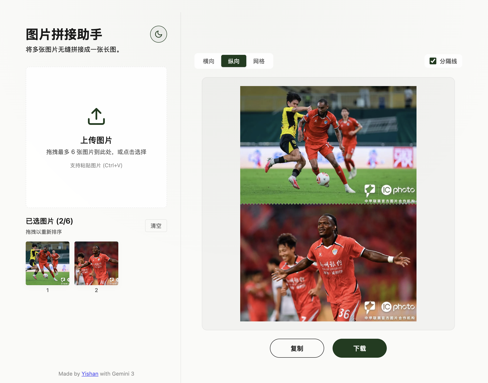

# Image Stitch Assistant

> [**中文版**](./README.zh-CN.md) · [English](./README.md)

Stitch multiple images into a single long picture, right in your browser — no uploads, no installs.



## Features

- **Multiple input methods** — drag & drop, file picker, or clipboard paste; fully keyboard-accessible upload and reordering.
- **Three layouts** — vertical, horizontal, and grid, with an optional wave divider between images.
- **Theme switcher** — dark and light themes, remembered across visits.
- **100% local & private** — images are processed only in the browser Canvas and are never uploaded to any server.
- **Safety limits** — each file must be under 10 MiB with an aspect ratio of at most 30:1; to avoid exhausting browser memory, the output is capped at 8192 px on the longest side and 20 megapixels, downscaling proportionally when needed.

## Tech Stack

- React 19 + Vite 7
- [@dnd-kit](https://dndkit.com/) for drag-to-reorder
- Plain Canvas API for stitching and PNG encoding
- Node.js ≥ 20.19 (see `.nvmrc`)

## Local Development

```bash
nvm use
npm ci
npm run dev
```

Common checks:

```bash
npm test        # run unit tests (node --test)
npm run lint    # run ESLint
npm run build   # production build into dist/
npm run preview # preview the production build
```

## Deployment

The default build targets a site served from the root path. If you deploy to a repository sub-path such as GitHub Pages, provide the path at build time:

```bash
VITE_BASE_PATH=/repository-name/ npm run build
```

For static hosting platforms, set the build command to `npm run build` and the publish directory to `dist`.

## Project Structure

- `src/lib/imageIntake.js` — image validation, count limits, and Object URL lifecycle.
- `src/lib/stitchLayout.js` — geometry and seam calculations for the three layouts.
- `src/lib/stitchRenderer.js` — Canvas drawing, output limits, and PNG encoding.
- `src/components/` — upload, sortable preview, settings, and result interactions.

## License

[MIT](./LICENSE) © Yishan
